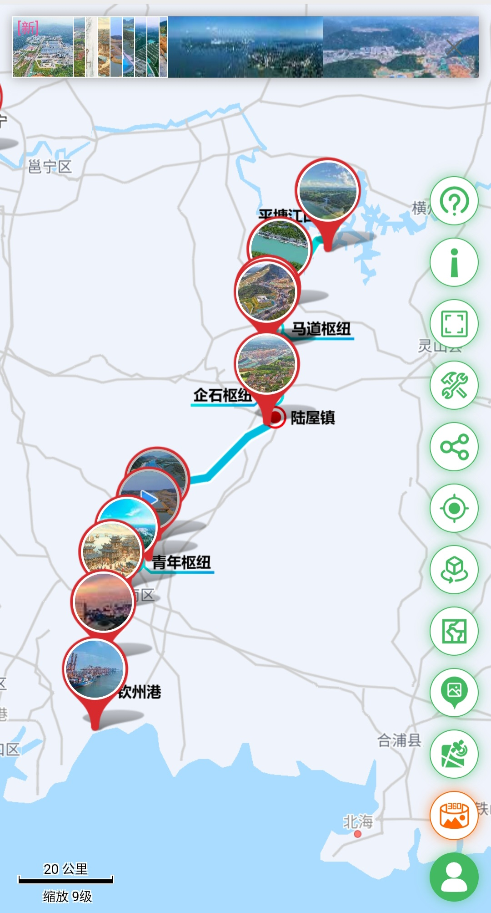
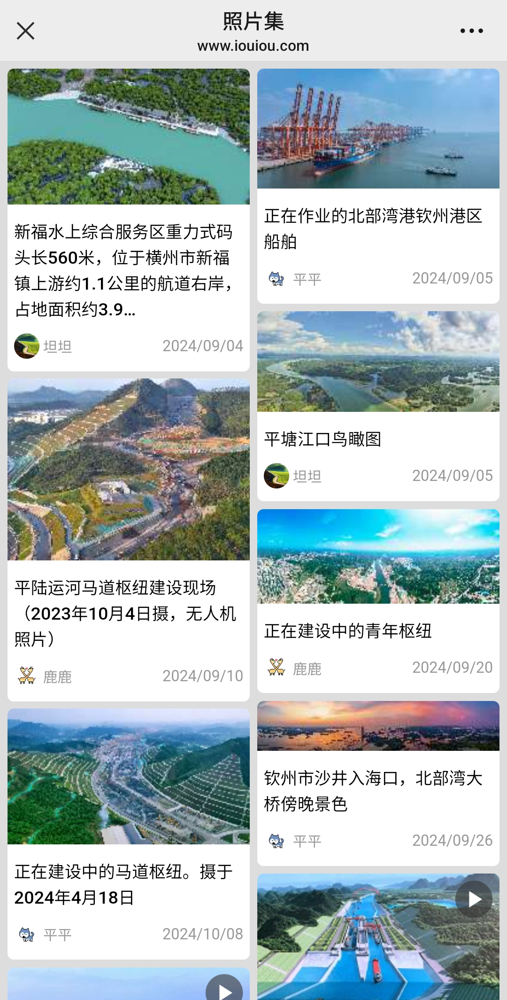
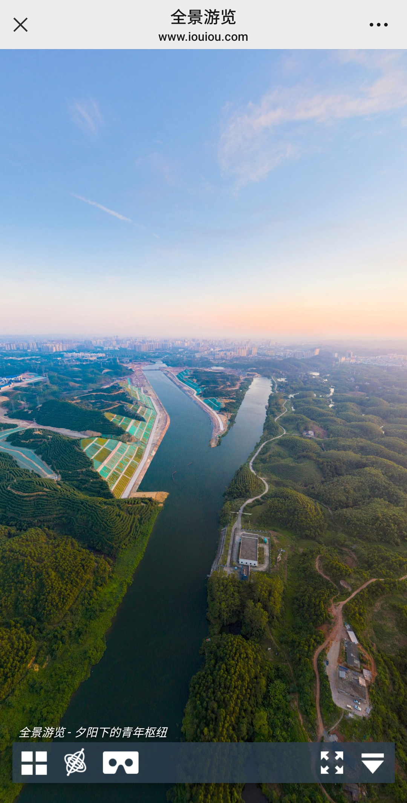
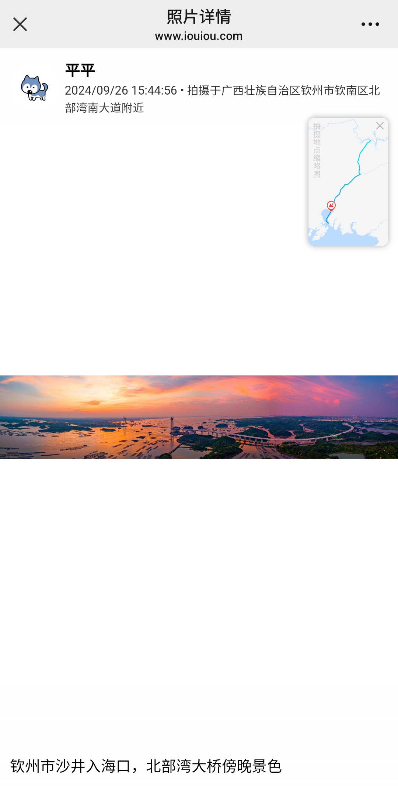
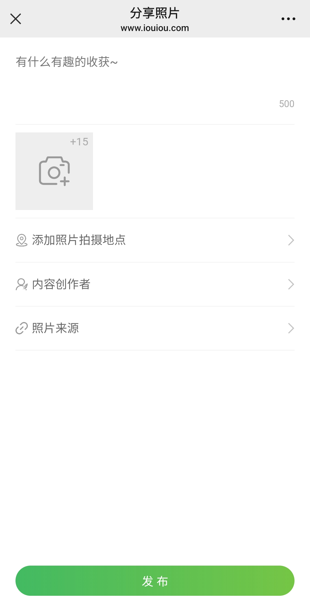

# xiaolutantan-web-vue
[网站地址](https://plyh.xyz)

NodeJS版本：14.17.6

后端未完成，暂时用： PHP

服务器：nginx

# 产品截图
<kbd>
    
    
    
    
    
    
</kbd>

# 开发相关
## Project setup
```
yarn install
```

### Compiles and hot-reloads for development
```
yarn serve
```

### Compiles and minifies for production
```
yarn build
```

### Lints and fixes files
```
yarn lint
```

### Customize configuration
See [Configuration Reference](https://cli.vuejs.org/config/).
